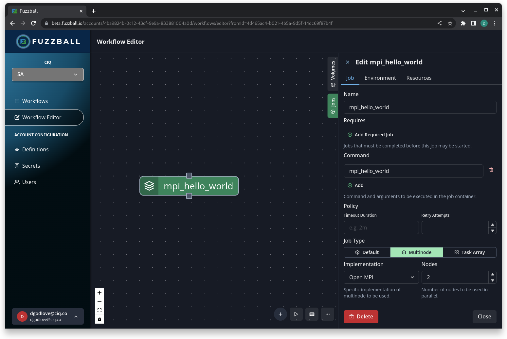
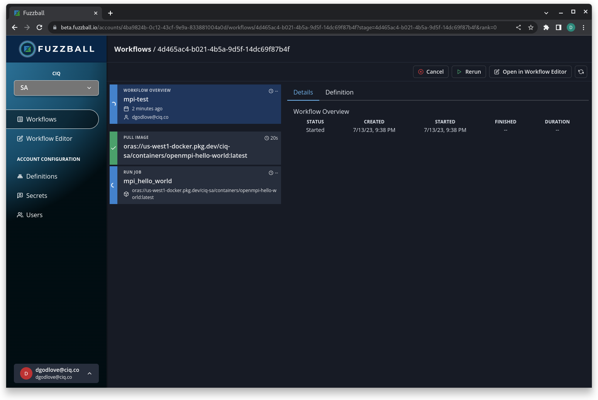
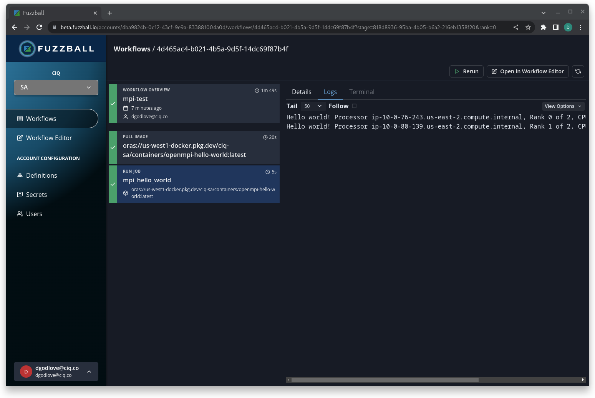
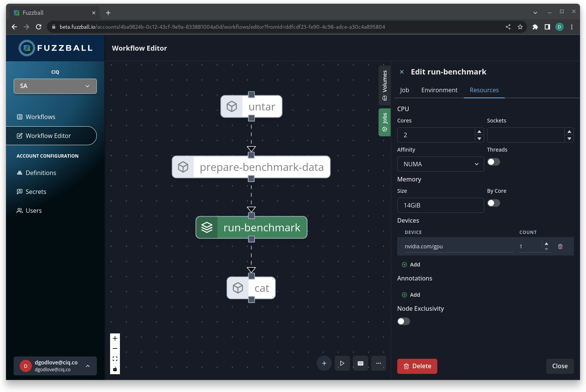

# HPC Specific Topics

### Objectives

- consider Apptainer runtime architecture
- learn about submitting containerized workflows through batch scheduling systems
- consider several strategies for containerized MPI processes
- do a deep dive into device drivers for GPUs and high-speed fabrics
- discuss job orchestration and demo Fuzzball

In this section we'll talk about the architecture of Apptainer as it pertains to HPC jobs and investigate how it interacts with HPC technology.

## Apptainer runtime architecture

Container platforms like Apptainer don't really extend the functionality of Linux systems. Instead they take several existing kernel and filesystem features and wrap them in a convenient interface to present to the user. In particular, container platforms like Apptainer use filesystem mounts and Linux Namespaces. It's important to understand the ways in which these technologies are used to grasp details about Apptainer's architecture and security posture. 

### Filesystem mounts

At its core, a container is a new root file system. In the case of Apptainer, the file system is stored as a [SquashFS](https://en.wikipedia.org/wiki/SquashFS) image within a Singularity Image Format (SIF) file. When a container is initiated, one of the first steps is to mount the container filesystem to the host filesystem. During this process Apptainer also takes care of the bind-mounts so that they all appear to be part of the new root file system. However at this point the container filesystem is just an image and some host files and directories mounted at a given location (the local state directory). In order for containerized processes to treat this filesystem as the root filesystem Apptainer must pivot into a new _mount namespace_ (next section).

Before leaving the topic of filesystem mounts, note that Apptainer mounts container filesystems as read-only and with the `nosuid` mount option to ensure that programs like `sudo` cannot be used within the container to elevate privileges. 

### Linux Namespaces

The Linux kernel has the ability to partition resources and make them available only to specific processes. This is referred to as _namespaces_. There are several different namespaces available to partition different types of resources. 

Consider this excerpt from the Linux Programmer's Manual:

```
$ man namespaces

NAMESPACES(7)


NAME
       namespaces - overview of Linux namespaces

DESCRIPTION
       A namespace wraps a global system resource in an abstraction that makes it appear to
       the processes within the namespace that they have their own isolated instance of the
       global resource.  Changes to the global resource are visible to other processes that
       are members of the namespace, but are invisible to  other  processes.   One  use  of
       namespaces is to implement containers.

       This page provides pointers to information on the various namespace types, describes
       the associated /proc files, and summarizes the APIs for working with namespaces.

   Namespace types
       The following table shows the namespace types available on Linux.  The second column
       of the table shows the flag value that is used to specify the namespace type in var‐
       ious APIs.  The third column identifies the manual page that provides details on the
       namespace  type.  The last column is a summary of the resources that are isolated by
       the namespace type.

       Namespace Flag            Page                  Isolates
       Cgroup    CLONE_NEWCGROUP cgroup_namespaces(7)  Cgroup root
                                                       directory
       IPC       CLONE_NEWIPC    ipc_namespaces(7)     System V IPC,
                                                       POSIX message
                                                       queues
       Network   CLONE_NEWNET    network_namespaces(7) Network devices,
                                                       stacks, ports,
                                                       etc.
       Mount     CLONE_NEWNS     mount_namespaces(7)   Mount points
       PID       CLONE_NEWPID    pid_namespaces(7)     Process IDs
       Time      CLONE_NEWTIME   time_namespaces(7)    Boot and monotonic
                                                       clocks
       User      CLONE_NEWUSER   user_namespaces(7)    User and group IDs
       UTS       CLONE_NEWUTS    uts_namespaces(7)     Hostname and NIS
                                                       domain name
[snip...]
```

When apptainer mounts the container filesystem to the host, it creates and pivots into a new Mount namespace. This causes processes within the container to "see" the container filesystem as the root filesystem. 

There are two more points about namespaces that are important to note in the context of Apptainer within HPC environments.  

First, Apptainer does not cause containers to enter any other namespace (besides the Mount namespace) by default. This means that containerized PIDs are visible in the host system PID tree, that the container utilizes the host's network, that Inter-Process Communication (IPC) works normally across containers etc. This minimal namespace isolation is an important aspect of Apptainer's architecture making it compatible with HPC in it's default configuration. 

Second, there is a "special" namespace called the User namespace that allows UIDs (and GIDs) on the host to be mapped to different UIDs within the namespace. Unlike the other namespaces, unprivileged users can leverage the User namespace on a properly configured system. This is commonly used to fake root privileges within the namespace and to aid in carrying out tasks (like creating Mount namespaces) that would normally require elevated privileges. On properly configured, modern systems Apptainer leverages the User namespace implicitly to perform container initiation actions that would normally require privilege and explicitly to allow users to build and enter containers as root (through the `--fakeroot` option).

### Process Management

As described in the section on Namespaces, Apptainer does not enter a new PID namespace by default and the containerized processes are part of the PID tree on the host. There is a process called "starter" (or "starter-suid" with a privileged installation) that is responsible for setting the container up. Consider the following example:

```
$ apptainer exec docker://alpine sleep 100 &
[3] 552340
[2]   Done                    apptainer exec --pid docker://alpine sleep 100

$ INFO:    Using cached SIF image
INFO:    gocryptfs not found, will not be able to use gocryptfs

$ ps --forest -u $USER
[...snip]
   7024 pts/0    00:00:03  |   \_ bash
 552572 pts/0    00:00:00  |   |   \_ starter
 552596 pts/0    00:00:00  |   |   |   \_ sleep
 552609 pts/0    00:00:00  |   |   |   \_ squashfuse_ll
[snip...]
```
As you can see, `starter` is the parent process of the containerized `sleep`.  

Note that the starter process is initialized with the kernel flag `PR_SET_NO_NEW_PRIVS` effectively blocking any containerized process from elevating privileges via any method. 

## Submitting Containerized Jobs to the Batch Scheduling System

With an understanding of Apptainer's runtime architecture we can appreciate why it works seamlessly with batch scheduling systems.

For this discussion we will assume Slurm, although most of the concepts will translate to other systems as well.  

Consider the following example:

```text
$ ll
total 78M
-rw-rw-r-- 1 user user 218 Apr 19 16:00 job.sh
-rwxrwxr-x 1 user user 78M Apr 19 15:52 lolcow.sif

$ cat job.sh 
#!/bin/bash
#SBATCH --job-name lolcow
#SBATCH --cpus-per-task=2
#SBATCH --mem-per-cpu=1
#SBATCH --partition=opa
#SBATCH --time=00:05:00
apptainer run /home/user/slurm/lolcow.sif

$ sbatch job.sh 
Submitted batch job 445

$ cat slurm-445.out 
INFO:    underlay of /etc/localtime required more than 50 (77) bind mounts
 ________________________________________
/ You will be winged by an anti-aircraft \
\ battery.                               /
 ----------------------------------------
        \   ^__^
         \  (oo)\_______
            (__)\       )\/\
                ||----w |
                ||     ||
```

Aside from the cow's dire prediction everything seems to be in order. Note that we can also change the command in the submission script to `/home/user/slurm/lolcow.sif` and run the SIF file as an executable. 

We can also specify bind mounts, with env vars or cli options, use input and output as in our section on analyzing data, run containers directly from Docker Hub (if the cluster has internet access), etc.  

In short, pretty much anything that you expect to work with basic jobs launched via Slurm will work as expected. 

### daemonization and cgroups

With other container solutions there can be problems with daemons and cgroups. Either the container may "escape" the batch scheduling system because it is launched and managed by a daemon on the compute node, or maybe the container platform wants to manage cgroups itself. In HPC environments the batch scheduler is expected to manage cgroups and to manage processes directly. The architecture of Apptainer lends itself to this since the containerized processes are simply processes that run like any others and can be easily managed.

### PID trees

It is possible to create a new PID namespace/PID tree for your containerized processes via the `--pid` flag, but this should be avoided in HPC environments. In some cases the new PID namespace will confuse the batch scheduling system and make it impossible for the scheduler to manage the resources properly. It can also present administrative difficulties if a user's job runs amok and must be debugged.  For this reason, some HPC centers choose to disable the PID namespace option in the Apptainer conf file.  

### cache-ing and IO optimization

If you are running a job array or a multinode job where each instance or rank is using the same container, you will want to ensure that the container is properly cached on shared storage before running it. To do this, you should ensure that your Apptainer cache location (discussed in a different section) is set to shared storage space. You can specify this with the `$APPTAINER_CACHEDIR` variable. 

Apptainer optimizes the file system in such a way that some applications will actually see an IO performance benefit when they are running in containers instead of on bare metal. Applications (like python or Matlab) where hundreds of small files are touched during execution can run into IO bottlenecks because of metadata operations. The read-only SIF file system optimizes these types of workloads so that metadata operations and resultant IO are drastically reduced. See [these findings posted by Wolfgang Resch at the NIH](https://github.com/wresch/python_import_problem).

## MPI Applications in Containers

MPI can be a bit more tricky than either running jobs under Slurm or utilizing GPUs. We will cover MPI in some detail. 

Single node MPI is fairly easy and can usually be performed simply by installing MPI within your container and calling `miprun` or `mpiexec` from within the container. This will set up multiple ranks and use multiple CPUs on the node.  

Multi-node MPI jobs can be more difficult to implement. There are a couple of hurdles to overcome. The first has to do with the MPI wire-up (the process by which MPI reaches out to other nodes, launches processes, assigns them rank, and gives them the information they need to communicate with the other jobs). The second hurdle has to do with implementing the high-speed interconnects usually used by MPI processes in HPC environments. For now we will focus on the wire up problem. We'll discuss the issues around high-speed interconnects a bit later. 

The Apptainer documentation has a good section [here](https://apptainer.org/docs/user/latest/mpi.html) to get you started using MPI within your containers. I will not duplicate the information contained there, but instead I'll show some real working examples of the two approaches that are detailed in the documentation. I'll also discuss a third approach that is not documented. 

The basic idea of the first two approaches is to have an MPI implementation inside of your container that matches an implementation installed on the target host, and then to call `mpiexec` or similar on the host with the `apptainer` command so that the wire-up process launches a new container for every rank. The first two approaches differ only in how they get the MPI implementation into the container. In the hybrid approach you install it there, while in the bind approach you just bind-mount it in from the host. 

The third and newer approach that I'll detail has the entire MPI process containerized and uses the fact that a batch processing system such as Slurm may have support for one of the process management interface (PMI) standards. The tool implementing PMI (in our case Slurm implementing PMI2) can then be used to carry out wire-up independent of and agnostic to the actual MPI version in the container. 

I developed these examples on a test cluster that I can access through CIQ's partnership with Dell. The cluster is running Slurm v22.05.2 from OpenHPC with PMI2 support and I have installed Open MPI v4.1.5 in my own space with support for pmi, ucx, and libfabric. For these demos I'll be relying heavily on work carried out by my colleague Jonathon Anderson and I'll be using a version of Wes Kendall's `mpi_hello_world.c` that Jonathon modified to provide addition descriptive information.  

Here's the script if you want to use it too!

```c
// Author: Wes Kendall                                                          
// Copyright 2011 www.mpitutorial.com                                           
// This code is provided freely with the tutorials on mpitutorial.com. Feel     
// free to modify it for your own use. Any distribution of the code must        
// either provide a link to www.mpitutorial.com or keep this header intact.     
//                                                                              
// An intro MPI hello world program that uses MPI_Init, MPI_Comm_size,          
// MPI_Comm_rank, MPI_Finalize, and MPI_Get_processor_name.                     
//                                                                              
// Modified to include getcpu() by Jonathon Anderson for ciq.co                                                                       
//                                                                              
#include <mpi.h>                                                                
#include <stdio.h>                                                              
#include <unistd.h>                                                             
#include <limits.h>                                                             
#include <stdlib.h>                                                             
#include <sys/syscall.h>                                                        
#include <sys/types.h>                                                          
                                                                                
int main(int argc, char** argv) {                                               
  // Initialize the MPI environment. The two arguments to MPI Init are not      
  // currently used by MPI implementations, but are there in case future        
  // implementations might need the arguments.                                  
  MPI_Init(NULL, NULL);                                                         
                                                                                
  // Get the number of processes                                                
  int world_size;                                                               
  MPI_Comm_size(MPI_COMM_WORLD, &world_size);                                   
                                                                                
  // Get the rank of the process                                                
  int world_rank;                                                               
  MPI_Comm_rank(MPI_COMM_WORLD, &world_rank);                                   
                                                                                
  // Get the name of the processor                                              
  char processor_name[MPI_MAX_PROCESSOR_NAME];                                  
  int name_len;                                                                 
  MPI_Get_processor_name(processor_name, &name_len);                            
                                                                                
  // Get CPU and NUMA information                                               
  unsigned int cpu, node;                                                       
  syscall(SYS_getcpu, &cpu, &node, NULL);                                       
                                                                                
  // Get mount namespace for container identity                                 
  char mnt_ns_buff[PATH_MAX];                                                   
  ssize_t mnt_ns_len = readlink("/proc/self/ns/mnt", mnt_ns_buff, sizeof(mnt_ns_buff)-1);
  if (mnt_ns_len == -1) {                                                       
    fprintf(stderr, "error getting mount namespace\n");                         
    exit(-1);                                                                   
  }                                                                             
  mnt_ns_buff[mnt_ns_len] = '\0';                                               
                                                                                
  // Print off a hello world message                                            
  printf("Hello world! Processor %s, Rank %d of %d, CPU %d, NUMA node %d, Namespace %s\n",
         processor_name, world_rank, world_size, cpu, node, mnt_ns_buff);       
                                                                                
  // Finalize the MPI environment. No more MPI calls can be made after this     
  MPI_Finalize();                                                               
}
```

### The Hybrid Model

This is probably the most popular way to run containerized MPI. You install an MPI implementation and version that matches (preferably to the patch number) the version that is installed on the host, and you compile your application in the container at build time. Then you launch your containerized MPI processes with the host MPI. The host MPI takes care of wire-up and the containerized MPI takes care of the communication during the job. The two never realize they are different. 

Here is the definition file that I used to containerize Open MPI in a way that was suitable to work with the Open MPI in my environment.

```
Bootstrap: docker
From: rockylinux:8

%files
    mpi_hello_world.c /opt

%environment
    # Point to OMPI binaries, libraries, man pages
    export OMPI_DIR=/opt/ompi
    export PATH="$OMPI_DIR/bin:$PATH"
    export LD_LIBRARY_PATH="$OMPI_DIR/lib:$LD_LIBRARY_PATH"
    export MANPATH="$OMPI_DIR/share/man:$MANPATH"
    # Work around a problem that UCX has with unprivileged user namespaces
    # See https://github.com/apptainer/apptainer/issues/769
    export UCX_POSIX_USE_PROC_LINK=n
    export LD_LIBRARY_PATH=/opt/ohpc/pub/mpi/ucx-ohpc/1.11.2/lib:/opt/ohpc/pub/mpi/libfabric/1.13.0/lib:/opt/ohpc/pub/mpi/ucx-ohpc/1.11.2/lib:$LD_LIBRARY_PATH

%post
    dnf -y update
    dnf -y install wget git gcc gcc-c++ make file gcc-gfortran bzip2 \
        dnf-plugins-core findutils librdmacm-devel
    dnf config-manager --set-enabled powertools

    export OMPI_DIR=/opt/ompi
    export OMPI_VERSION=4.1.5
    export OMPI_URL="https://download.open-mpi.org/release/open-mpi/v4.1/openmpi-$OMPI_VERSION.tar.bz2"
    mkdir -p /var/tmp/ompi
    mkdir -p /opt
    
    cd /var/tmp/ompi
    wget https://github.com/openhpc/ohpc/releases/download/v2.4.GA/ohpc-release-2-1.el8.x86_64.rpm
    dnf install -y ./ohpc-release-2-1.el8.x86_64.rpm
    dnf -y update
    dnf -y install libfabric-ohpc libpsm2-devel ucx-ib-ohpc ucx-ohpc slurm-ohpc \
        slurm-devel-ohpc slurm-libpmi-ohpc ucx-rdmacm-ohpc ucx-ib-ohpc
    export LD_LIBRARY_PATH=/opt/ohpc/pub/mpi/ucx-ohpc/1.11.2/lib:/opt/ohpc/pub/mpi/libfabric/1.13.0/lib:/opt/ohpc/pub/mpi/ucx-ohpc/1.11.2/lib:$LD_LIBRARY_PATH

    cd /var/tmp/ompi  
    wget -O openmpi-$OMPI_VERSION.tar.bz2 $OMPI_URL && tar -xjf openmpi-$OMPI_VERSION.tar.bz2
    cd /var/tmp/ompi/openmpi-$OMPI_VERSION 
    
    ./configure --prefix=$OMPI_DIR --with-pmi --with-ucx=/opt/ohpc/pub/mpi/ucx-ohpc/1.11.2 --without-verbs --with-libfabric=/opt/ohpc/pub/mpi/libfabric/1.13.0
    make -j8 install
    cd / && rm -rf /var/tmp/ompi

    export PATH=$OMPI_DIR/bin:$PATH
    export LD_LIBRARY_PATH=$OMPI_DIR/lib:$LD_LIBRARY_PATH

    cd /opt && mpicc -o mpi_hello_world mpi_hello_world.c
```

As you can see, it was no easy task to containerize MPI in this way. The version of MPI installed on the host is compiled with support from a lot of libraries installed using [OpenHPC](https://openhpc.community/). To get things working I needed to install many of the same OpenHPC rpms inside the container and put those libraries on the LD_LIBRARY_PATH so they were available to Open MPI during compilation.

To finish the example, here is the batch submission script I use to launch test jobs. 

```bash
#!/bin/bash
#SBATCH --job-name apptainer-hybrid-mpi
#SBATCH -N 2
#SBATCH --tasks-per-node=1
#SBATCH --partition=opa
#SBATCH --time=00:05:00

export FI_LOG_LEVEL=info 
mpirun -n 2 apptainer exec  hybrid-ompi.sif /opt/mpi_hello_world
```

And the command to submit the job:

```text
$ sbatch job.sh 
Submitted batch job 446
```

Because the variable `FI_LOG_LEVEL` is set to `info`, the `slurm*.out` file is very verbose.  But here are the high points. 

```text
$ grep "Hello" slurm-446.out 
Hello world! Processor c6, Rank 1 of 2, CPU 0, NUMA node 0, Namespace mnt:[4026532737]
Hello world! Processor c5, Rank 0 of 2, CPU 0, NUMA node 0, Namespace mnt:[4026532721]

$ grep "Opened" slurm-446.out 
libfabric:316582:core:core:fi_fabric_():1264<info> Opened fabric: psm2
libfabric:1117678:core:core:fi_fabric_():1264<info> Opened fabric: psm2
```

The first few lines show the two jobs that ran on two different compute nodes (c5, and c6). They both used CPU 0 and ran in two different namespaces (showing that they were in two different containers). The second series of lines shows that libfabric utilized the psm2 interface (not to be confused with PMI2) which is supported by Omni-Path and that the ranks were therefore connected via high-speed interconnect. Groovy! 

If I change the submission script to run 2 processes per node like so (and reduce verbosity) here is the result:

```bash
#!/bin/bash
#SBATCH --job-name apptainer-hybrid-mpi
#SBATCH -N 2
#SBATCH --tasks-per-node=2
#SBATCH --partition=opa
#SBATCH --time=00:05:00

# export FI_LOG_LEVEL=info 
mpirun -n 4 apptainer exec  hybrid-ompi.sif /opt/mpi_hello_world
```

```text
$ sbatch job.sh 
Submitted batch job 447

$ cat slurm-447.out 
Hello world! Processor c5, Rank 0 of 4, CPU 0, NUMA node 0, Namespace mnt:[4026532722]
Hello world! Processor c5, Rank 1 of 4, CPU 127, NUMA node 1, Namespace mnt:[4026532725]
Hello world! Processor c6, Rank 2 of 4, CPU 0, NUMA node 0, Namespace mnt:[4026532738]
Hello world! Processor c6, Rank 3 of 4, CPU 124, NUMA node 1, Namespace mnt:[4026532741]
```

Note that the jobs ran in 4 unique namespaces showing that each rank uses a unique container. 

This way of running containerized MPI jobs _works_, but it is very difficult to set up and the container is not portable. If we tried to run this on a system with a different MPI version chances are high that it would break.

### The Bind Model

The bind model takes pretty much the same approach, but instead of building a container with the MPI implementation installed in it, you bind-mount in the appropriate libraries at runtime. 

The definition file that I used to accomplish an MPI run with the bind model was much simpler. Note that in this case `mpi_hello_world` was first compiled on the host system and then the binary was placed into the container at build time.  

```
Bootstrap: docker
From: rockylinux:8

%files
    mpi_hello_world /opt

%environment
    export LD_LIBRARY_PATH=/opt/ohpc/pub/mpi/ucx-ohpc/1.11.2/lib:/opt/ohpc/pub/mpi/libfabric/1.13.0/lib:/home/user/ompi/lib:$LD_LIBRARY_PATH
    export PATH=/opt/ohpc/pub/mpi/ucx-ohpc/1.11.2/bin:/opt/ohpc/pub/mpi/libfabric/1.13.0/bin:/home/user/ompi/bin:$PATH
```

Although the definition file is simpler overall, you can see that it has a very complicated `LD_LIBRARY_PATH` and `PATH` declaration. These libraries do not exist in the container, but will be bind mounted in from the host at runtime.  

Even though the definition file was comparatively simple, the actual bind-path was less so. After a fair amount of trial and error I arrived at this incantation.  

```text
$ export APPTAINER_BINDPATH=/opt/ohpc,/usr/lib64/libevent_core-2.1.so.6,/usr/lib64/libevent_pthreads-2.1.so.6,/usr/lib64/libpmi2.so.0,/usr/lib64/libpmi.so.0,/usr/lib64/librdmacm.so.1,/usr/lib64/slurm/libslurm_pmi.so,/usr/lib64/libefa.so.1,/usr/lib64/libibverbs.so.1,/usr/lib64/libpsm2.so.2,/usr/lib64/libnl-3.so.200,/usr/lib64/libnl-route-3.so.200,/usr/lib64/libnuma.so.1
```

This is because MPI (especially MPI with support for libfabric etc.) relies on a lot of libraries. 

It is tempting to just bind all of `/lib64` into the container and be done with it, but that sounds like something that is very likely to break unless you get very lucky. As it stands, I suspect that this would probably break if my host OS and container OS differed significantly. (But honestly this might break in that case anyway since these libraries may be API/ABI incompatible with a different container.)

Anyway, once I was able to track down all of the necessary libraries I could build the following submission script:

```bash
#!/bin/bash
#SBATCH --job-name apptainer-bind-mpi
#SBATCH -N 2
#SBATCH --tasks-per-node=1
#SBATCH --partition=opa
#SBATCH --time=00:05:00

export FI_LOG_LEVEL=info 
export APPTAINER_BINDPATH=/opt/ohpc,/usr/lib64/libevent_core-2.1.so.6,/usr/lib64/libevent_pthreads-2.1.so.6,/usr/lib64/libpmi2.so.0,/usr/lib64/libpmi.so.0,/usr/lib64/librdmacm.so.1,/usr/lib64/slurm/libslurm_pmi.so,/usr/lib64/libefa.so.1,/usr/lib64/libibverbs.so.1,/usr/lib64/libpsm2.so.2,/usr/lib64/libnl-3.so.200,/usr/lib64/libnl-route-3.so.200,/usr/lib64/libnuma.so.1

mpiexec apptainer exec bind-ompi.sif /opt/mpi_hello_world
```

Results with this method were identical to those above:

```
$ grep "Hello" slurm-448.out 
Hello world! Processor c6, Rank 1 of 2, CPU 0, NUMA node 0, Namespace mnt:[4026532740]
Hello world! Processor c5, Rank 0 of 2, CPU 0, NUMA node 0, Namespace mnt:[4026532724]

$ grep "Opened" slurm-448.out 
libfabric:316997:core:core:fi_fabric_():1264<info> Opened fabric: psm2
libfabric:1118046:core:core:fi_fabric_():1264<info> Opened fabric: psm2
```

This way of running containerized MPI also _works_.  But after compiling an MPI enabled binary on the host, copying it into a plain container, and then bind-mounting all of the libraries and MPI executables to actually run the binary into the container as well, I found myself beginning to wonder what was the point of the _actual container_ in the bind model. There really doesn't seem to be any advantage (and indeed there are many disadvantages) to this approach over just running the application on bare metal.  

### The Containerized Model (with PMI)

This work was originally derived from Jonathon Anderson's investigation of Spack and its ability to create MPI enabled containers. You can watch him give an in-depth presentation on this subject [here](https://youtu.be/VkNRQ8YsdE8?t=3554) 

The basic idea behind the containerized model is to put the entire MPI framework into a container along with the MPI application and then to use a tool that implements one of the PMI standards to perform the wire-up step.  In this case, we are able to use PMI2 with our version of Slurm (which we installed via OpenHPC). 

Instead of building a complicated definition file from scratch, we relied on Spack to do the dirty work. First, we created a `spack.yaml` file specifying that we wanted to install the OSU micro benchmarks suite along with OpenMPI and libfabric. In the yaml, we also specified that the installation should be containerized on a Rocky base with libfabric and some metadata. Here is what that looks like.

```yaml
spack:
  specs:
  - gmake @4.3
  - osu-micro-benchmarks
  - openmpi fabrics=ofi +pmi +legacylaunchers
  - libfabric fabrics=sockets,tcp,udp,psm2,verbs

  container:
    format: singularity 

    images:
      os: rockylinux:8
      spack: v0.20.0

    strip: true

    os_packages:
      final:
        - libgfortran

    labels:
      app: "osu-micro-benchmarks"
      mpi: "openmpi"
```

Much simpler than the definition file I created above. But how do you use it to build a container?

The command `spack containerize` will spit out a definition file based on this yaml spec. Using that definition file as a base, I was able to add Jonathon's `mpi_hello_world.c` program and compile it in the container.  

This definition file is pretty complicated but it is very interesting for (at least) 2 reasons. First, the container actually uses Spack to do the install and because of that everything is compiled from source. Second, the definition file implements a multi stage build where the build artifacts are copied to a clean run environment which reduces the final container's size. 

Here is the final definition file:

```text
Bootstrap: docker
From: spack/rockylinux8:v0.20.0
Stage: build

%files
  mpi_hello_world.c /opt

%post
  # Create the manifest file for the installation in /opt/spack-environment
  mkdir /opt/spack-environment && cd /opt/spack-environment
  cat << EOF > spack.yaml
spack:
  specs:
  - gmake @4.3
  - osu-micro-benchmarks
  - openmpi fabrics=ofi +pmi +legacylaunchers
  - libfabric fabrics=sockets,tcp,udp,psm2,verbs

  concretizer:
    unify: true
  config:
    install_tree: /opt/software
  view: /opt/view
EOF

  # Install all the required software
  . /opt/spack/share/spack/setup-env.sh
  spack -e . concretize
  spack -e . install
  spack gc -y
  spack env activate --sh -d . >> /opt/spack-environment/environment_modifications.sh

  # Strip the binaries to reduce the size of the image
  find -L /opt/view/* -type f -exec readlink -f '{}' \; | \
    xargs file -i | \
    grep 'charset=binary' | \
    grep 'x-executable\|x-archive\|x-sharedlib' | \
    awk -F: '{print $1}' | xargs strip

    export PATH=/opt/view/bin:$PATH                                               
    cd /opt && mpicc -o mpi_hello_world mpi_hello_world.c    

Bootstrap: docker
From: docker.io/rockylinux:8
Stage: final

%files from build
  /opt/spack-environment /opt
  /opt/software /opt
  /opt/._view /opt
  /opt/view /opt
  /opt/spack-environment/environment_modifications.sh /opt/spack-environment/environment_modifications.sh
  /opt/mpi_hello_world /opt

%post
  # Update, install and cleanup of system packages needed at run-time
  dnf update -y && dnf install -y epel-release && dnf update -y
  dnf install -y libgfortran
  rm -rf /var/cache/dnf && dnf clean all
  # Modify the environment without relying on sourcing shell specific files at startup
  cat /opt/spack-environment/environment_modifications.sh >> $SINGULARITY_ENVIRONMENT

%labels
  app osu-micro-benchmarks
  mpi openmpi
```

The resulting container is 198 MBs.  

In this case, we will use `srun` to launch the containerized process to take advantage of Slurm's MPI support.  Here is the command:

```text
$ FI_LOG_LEVEL=info srun --partition=opa --mpi=pmi2 --ntasks=2 --tasks-per-node=1 \
    --output=slurm.out --error=slurm.out \
    apptainer exec contained-ompi.sif /opt/mpi_hello_world

$ grep "Hello" slurm.out 
Hello world! Processor c5, Rank 0 of 2, CPU 91, NUMA node 1, Namespace mnt:[4026532725]
Hello world! Processor c6, Rank 1 of 2, CPU 91, NUMA node 1, Namespace mnt:[4026532740]

$ grep "Opened" slurm.out 
libfabric:317498:1681965417::core:core:fi_fabric_():1341<info> Opened fabric: psm2
libfabric:1118552:1681965417::core:core:fi_fabric_():1341<info> Opened fabric: psm2
libfabric:317498:1681965417::core:core:fi_fabric_():1341<info> Opened fabric: psm2
libfabric:1118552:1681965418::core:core:fi_fabric_():1341<info> Opened fabric: psm2
```

This approach maintains all of the advantages of containerization while still delivering a multinode MPI-enabled process that utilizes the cluster's high-speed interconnect. 

## Device drivers

Drivers like those that run GPU devices and high-speed interconnects pose special challenges for container platforms like Apptainer. The crux of the issue is that drivers typically compile kernel modules and containers share the kernel with the host system. This can lead to situations where the driver libraries installed in the container are of an incorrect type or version number to communicate with the kernel module.

We will begin by reviewing the NVIDIA GPU driver and the `--nv` option in detail, and use this "case study" to understand issues with other types of drivers. 

### The NVIDIA `--nv` option

If you go to a node that has an installed NVIDIA GPU and driver and run the following command, you will see some driver modules listed:

```text
$ lsmod | grep nvidia
nvidia_uvm           2895872  0
nvidia_drm             73728  2
nvidia_modeset       1220608  2 nvidia_drm
nvidia              56406016  94 nvidia_uvm,nvidia_modeset
[snip...]
```

The main kernel module that we are interested in is called `nvidia`. Let's check its version number:

```text
$ modinfo nvidia | grep version
version:        525.85.05
srcversion:     6486826C11DE6850EA9AD88
```

My (current) driver version is 525.85.05. Yours might be different. So our challenge is to find a set of libraries that match exactly the module version 525.85.05. We could go download the appropriate driver from the NVIDIA website and install all of the driver libraries in our container. In the early days of Apptainer, that is exactly what we would have done.  

But you may already see the problem with this approach. When you ran the same commands above did you get a different module version? If so, the container that I build using this approach will work on my machine but not on your machine. The driver version on my machine is also a bit outdated. But if I build a container with libraries appropriate for the v525.85.05 kernel module and then update my machine the container won't work anymore. 

So, maybe a better approach is to just find all of the libraries on the host that match the kernel module and bind-mount them into the container at runtime. That is the purpose of the `--nv` option. (The `--rocm` option works in a similar way for AMD cards).

Let's look at the `--nv` option for a detailed example to see what is happening under the hood. If you look at the base of your Apptainer installation, you will see a file called `<apptainer-base>/etc/nvliblist.conf`. Here are the first 20 lines of my version of that file for illustration.

```text
$ head -n 20 /opt/apptainer/default/etc/apptainer/nvliblist.conf 
# NVLIBLIST.CONF
# This configuration file determines which NVIDIA libraries to search for on 
# the host system when the --nv option is invoked.  You can edit it if you have
# different libraries on your host system.  You can also add binaries and they
# will be mounted into the container when the --nv option is passed.

# put binaries here
# In shared environments you should ensure that permissions on these files 
# exclude writing by non-privileged users.  
nvidia-smi
nvidia-debugdump
nvidia-persistenced
nvidia-cuda-mps-control
nvidia-cuda-mps-server

# put libs here (must end in .so) 
libcuda.so
libEGL_installertest.so
libEGL_nvidia.so
libEGL.so
```

The comments at the top of this file do a good job of explaining it's purpose. Note that the library `libcuda.so` is actually not part of CUDA. It is the library that allows CUDA enabled code to speak to the driver. So it is tightly coupled to the version of the kernel module on the host and should be bind-mounted in at runtime rather than installed in the container.  

Next let's look for the location of this library on the host system.  

```text
$ ldconfig --print-cache | grep libcuda.so*
	libcuda.so.1 (libc6,x86-64) => /lib64/libcuda.so.1
	libcuda.so.1 (libc6) => /lib/libcuda.so.1
	libcuda.so (libc6,x86-64) => /lib64/libcuda.so
	libcuda.so (libc6) => /lib/libcuda.so
```

The 64-bit versions of the driver are located in `/lib64`. If we track these down we can see that they are symlinks to libraries that are based on the GPU driver version. For instance on my system:

```text
$ ll /lib64/libcuda.so*
lrwxrwxrwx. 1 root root  12 Mar 21 20:42 /lib64/libcuda.so -> libcuda.so.1
lrwxrwxrwx. 1 root root  20 Mar 21 20:42 /lib64/libcuda.so.1 -> libcuda.so.525.85.05
-rwxr-xr-x. 1 root root 29M Mar 21 20:42 /lib64/libcuda.so.525.85.05
```

Note that `libcuda.so.525.85.05` is an exact match for the module v525.85.05 that we determined 

So how do these and other libraries show up in the container? Well, first of all, Apptainer searches the host system library cache for libraries that match the patters found in `nvliblist.conf` in much the same way that we just did above! Then it bind mounts all of the libraries and symlinks into a special directory within the container and adds that directory to `$LD_LIBRARY_PATH`. Observe: 

```text
$ apptainer shell --nv docker://ubuntu
INFO:    Using cached SIF image

Apptainer> echo $LD_LIBRARY_PATH
/.singularity.d/libs

Apptainer> ls -lh /.singularity.d/libs/libcuda.so*
-rwxr-xr-x. 1 root root 29M Mar 21 20:42 /.singularity.d/libs/libcuda.so
-rwxr-xr-x. 1 root root 29M Mar 21 20:42 /.singularity.d/libs/libcuda.so.1
```

The symlinks are resolved and the actual binary (in this case `libcuda.so.525.85.05`) is bind mounted in and renamed to name of the symlink on the host. 

This relatively simple methods works ~99% of the time, but you may sometimes run into issues. Typically these can be resolved by editing the contents of `nvliblist.conf` to include (or more commonly exclude) different libraries. With the adoption of the user namespace for unprivileged Apptainer installations it is possible for unprivileged users to create their own installations of Apptainer and modify `nvliblist.conf` to fit their individual needs.

### Issues with High-Speed Interconnects

We just discussed the model for using GPU drivers portably via bind mounting provided by the convenience flags `--nv` and `--rocm`.  In previous sections we also discussed using PMI to genericise container wire-up and render it more portable across systems. The issue of **drivers for high-speed interconnects** is related to both of these topics and is a complicated problem impacting container portability. 

Here's a summary of the issue. When you use an MPI enabled code, you usually want (need?) to use a high-performance fabric like InfiniBand or Omni-Path for inter-process communication to take advantage of fast hardware and avoid network bottlenecks. But the drivers for high-speed fabric adapters follow the same pattern as the GPU drivers detailed above. One component of the driver is installed as a kernel module and user space libraries are installed to interact with the module. So installing the fabric adapter into your container might break portability. 

Can we simply use the same strategy and bind-mount user libraries from the host system into the container to maintain portability? In the case of high-speed interconnects this becomes more difficult (impossible?) because the version of MPI that you are using to compile and run your MPI code may itself be compiled directly against and tightly coupled to the fabric adapter driver. This means that if you install the driver libraries into you container, they have the potential to conflict with the kernel module on the host and break. And if you bind-mount the libraries from the host into the container they have the potential to conflict with your installed MPI application and break. This situation is avoided with NVIDIA's GPU drivers because of the separation between the hardware driver and CUDA. A specific driver version (which is tied to hardware) can support multiple CUDA version (which are tied to the containerized software). 

This problem may be mitigated by the use of libfabric. Libfabric provides an abstraction layer (similar to CUDA) allowing a one to many mapping of MPI to fabric adapters. MPI implementations compiled against libfabric are thereby rendered more flexible and can run in environments with different fabric adapter flavors. This is a fairly new solution that has not yet undergone extensive testing in the context of containers, so it may still have some rough edges.  

System administrators may consider creating a suite of containers with MPI and fabric adapters/libfabric pre-installed for their users to leverage as base containers, but this strategy is not without pitfalls as users may have unique needs for base containers and be unable to use those preconfigured by admins. MPI enabled applications also tend to be very sensitive to the way in which they are compiled from a performance and optimization standpoint. These issues highlight a major theme within containerization; there is often a trade-off between performance and portability.

## Orchestration

No discussion of the modern container ecosystem is complete with orchestration. Container orchestration is of such fundamental importance in the cloud-native space that many developers don't really distinguish between container platforms (like Docker and podman) and orchestration tools (like Kubernetes). Orchestration has seen much less adoption within the HPC space. This is due to several different factors. 

1. Most existing orchestration tools are only compatible with OCI containers and runtimes. There was a (successful) effort called Singularity-CRI to get Apptainer running under Kubernetes some years ago, but it lacked community support and has not been maintained. 
2. Existing orchestration tools heavily favor a cloud-native worldview that assumes containers should run as (web) services and communicate with one another via a particular network specification. Therefore tools like Kubernetes place a heavy emphasis on features that prevent containers from stopping, restarting them automatically, etc. Much of this feature set is irrelevant to the job-centric worldview of HPC where workflows have a defined start and end point and communicate with one another through MPI or not at all in the case of parallel, high-throughput workflows.
3. Workflow managers like Slurm already solve many of the problems in HPC problems that are addressed by orchestration elsewhere, so many HPC users don't understand how they could benefit from using orchestration. 

In spite of these factors, the HPC community is increasingly looking for orchestration solutions to run containerized workflows. This is due to increased pressure to move workflows from on-prem clusters to the cloud, increasing desire to series of jobs with complicated dependencies (often referred to as pipelines), and increasing recognition the container orchestration has become mature and widely used outside of HPC. 

Fuzzball is a new container orchestration platform specifically built for _job_ orchestration with HPC in mind. It solves the MPI issues discussed above and allows users to create workflows comprising many jobs running as directed acyclic graphs (DAGs). It also runs either on prem or in the cloud and is planned to federate across multiple clusters. Fuzzball is in beta testing and is still being developed, but we can look at some quick examples to get an idea of it's capabilities. 

In fuzzball, all workflows run as a collection of jobs within containers. Workflows are specified via yaml files. Consider the following yaml that implements the MPI hello world example we saw earlier. 

```yaml
version: v1
jobs:
  mpi_hello_world:
    image:
      uri:
        oras://us-west1-docker.pkg.dev/ciq-sa/containers/openmpi-hello-world:latest
      secrets:
        password: ${{ secret "CIQ_SA_RO" }}$
        username: _json_key_base64
    command:
      - mpi_hello_world
    resource:
      cpu:
        cores: 1
        affinity: NUMA
      memory:
        size: 1GB
    multinode:
      nodes: 2
      implementation: openmpi
```

This job can be submitted to Fuzzball like so:

```
$ fuzzball workflow start --watch mpi-hello-world.yaml 
Workflow "6b8e2fd2-4b2c-48a1-9bf6-8925483d23a5" started.

$ fuzzball workflow describe 6b8e2fd2-4b2c-48a1-9bf6-8925483d23a5
Name:      mpi-hello-world.yaml
Email:     dgodlove@ciq.co
UserId:    74a78835-1601-4364-a85c-0eee707b8017
Status:    STAGE_STATUS_FINISHED
Created:   2023-07-14 02:38:54PM
Started:   2023-07-14 02:38:54PM
Finished:  2023-07-14 02:43:03PM
Error:     

Stages:
KIND     | STATUS   | NAME                                          | STARTED               | FINISHED
Workflow | Finished | 6b8e2fd2-4b2c-48a1-9bf6-8925483d23a5          | 2023-07-14 02:38:54PM | 2023-07-14 02:43:03PM
Image    | Finished | oras://us-west1-docker.pkg.dev/ciq-sa/cont... | 2023-07-14 02:38:55PM | 2023-07-14 02:39:14PM
Job      | Finished | mpi_hello_world                               | 2023-07-14 02:42:57PM | 2023-07-14 02:43:02PM
```

And once it is finished running you can view the logs:

```
$ fuzzball workflow log 6b8e2fd2-4b2c-48a1-9bf6-8925483d23a5 mpi_hello_world
Hello world! Processor ip-10-0-61-179.us-east-2.compute.internal, Rank 0 of 2, CPU 0, NUMA node 0, Namespace mnt:[4026532301]
Hello world! Processor ip-10-0-50-198.us-east-2.compute.internal, Rank 1 of 2, CPU 0, NUMA node 0, Namespace mnt:[4026532301]
```

Note that we simply need to specify that this is a multinode job using the `openmpi` implementation and Fuzzball is able to handle wire-up on its own. Available implementations include `openmpi`, `mpich`, and `gasnet`.  

In the example above, Fuzzball is also handling a secret (called `CIQ_SA_RO`) that is used to access the Apptainer image from the private Google artifact registry (an OCI registry). Fuzzball can also mount storage (like s3 buckets, ftp servers, or GitHub repos) directly to jobs, utilize GPU resources, etc via appropriate yaml configuration. 

All actions can be carried out in Fuzzball either by using the terminal CLI or a web-based CLI. Jobs can be created and edited in the workflow editor:



Workflows can then be submitted.



And afterwards logs can be reviewed and downloaded.



Workflows can be significantly more complicated than this. Consider this workflow running a benchmark in Gromacs that utilizes GPUs, MPI, mounted volumes, and job dependencies.



Job dependencies can also be as complicated as you wish provided that the dependencies are not cyclical. Consider this fictional job that has a complicated dependency structure composed of simple jobs, job arrays, and multinode MPI jobs. 


## Assignment

System administrators may choose to create and maintain a small library of base containers that users can leverage when containerizing new applications. One reason would be to allow users to base their containers on known good MPI configurations. We will simulate this situation. 

You should be able to copy and paste the `mpi-hello-world.c` file and the definition file created from the `spack.yaml` file in the discussion above.  If you place those files in a directory, you can use them to build an MPI-enable apptainer container.  Build it and double check that it works using the `srun` example above assuming your Slurm installation supports PMI2. (You can check this with `srun --mpi=list`). 

There is no reason to rebuild this container from scratch if you want to run a different MPI-enabled application. You can use this as a base container via the `Bootstrap: localimage` header.  

Now, put yourself in the position of a researcher who needs to compile some code against an MPI implementation in a container. Go online and find some MPI example code or the source code for an application that utilizes MPI.  (For a challenge, have a look at OpenRadioss on GitHub. CIQ has written a few blog posts detailing the process of building and running OpenRadioss in a container). Once you have a some source code in mind, create a new def file that pulls the source code into the MPI base container you already built and compiles against that installation.  For bonus points, get the program working in you test cluster! 
